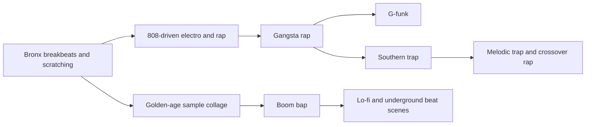

# Analytical Report on Beats, Effects, and Signature Sounds in Hip Hop, Rap, Trap, Boom Bap, and Gangsta Rap

## Executive summary

Across hip hop and rap production, the central divide is not simply “old versus new,” but **break-derived, sample-collage rhythm design** versus **synthetic, sub-bass-led rhythm design**. Boom bap sits closest to the first pole: chopped or replayed break logic, snappy kicks and snares, palpable swing, and a harmonic palette rooted in jazz, soul, and funk. Trap sits closest to the second: deep 808 sub-bass, half-time-feel drum grids, fast hi-hat subdivision, sparse orchestration, and heavy use of synthetic pads, bells, and bass-focused mixing. Gangsta rap spans both modes, but its most recognizable West Coast branch, G-funk, adds smoother mid-tempo grooves, 1970s funk lineage, and replayed or sampled synth leads and bass figures. citeturn15view1turn31view1turn26view2turn26view0

The **canonical drum/sampler hardware vocabulary** remains unusually stable across eras. The Roland TR-808 is foundational because its analog kick can be extended into the long-decay “808” bass sound, while the TR-909 contributes punchier hybrid drum tones and shuffle-capable sequencing. The Akai MPC family became standard because it turned sample chopping, pad performance, and groove feel into a compositional system; the E-mu SP-1200 became equally important because its gritty 12-bit sound and workflow helped define golden-era hip hop. In later beat culture, the SP-404 became a lo-fi and sample-performance staple. citeturn13view4turn13view5turn13view6turn25search0turn34view0

If one needs a fast style heuristic, it is this: **boom bap prioritizes swing, grit, and sample character; trap prioritizes sub-bass control, hat detail, and negative space; gangsta rap prioritizes narrative force, stark one-shots, and cinematic signifiers; G-funk prioritizes funk-derived melodic identity and cruising mid-tempo smoothness.** The most repeated production moves across all of them are layering, transient shaping, selective quantization, filter automation, pitch-shifting, chopping, saturation, and arrangement-by-contrast. citeturn14view0turn14view2turn18view0turn17view2turn17view1turn13view7

For rigorous study, the highest-value source stack is: **original tracks and registry essays; producer and manufacturer interviews; official DAW/plugin documentation; academic or trade analyses; then secondary reconstruction tutorials.** That order best preserves what is truly stylistic, what is technological, and what is merely fashionable. citeturn26view4turn26view5turn13view4turn13view5turn18view0turn18view3turn22search0

## Subgenre comparison

The tempo ranges below are best treated as **working production ranges**, not hard borders. Hip hop subgenres overlap heavily; what usually differentiates them more decisively is **drum grammar, source material, and mix priorities** than BPM alone. citeturn31view0turn31view1turn31view2turn31view3

| Subgenre | Working tempo and feel | Core drum grammar | Common melodic material | Signature textures and effects | Source anchors |
|---|---|---|---|---|---|
| **Classic rap / general sample-based hip hop** | Often clusters in the high-80s to low-100s in representative golden-era templates; strong head-nod pocket rather than extreme speed | Kicks and snares on a simple backbone, then swung pickup notes, hats, ghost accents, and break-derived feel | Soul, funk, jazz hooks; bass loops; horn or guitar chops; piano stabs | Scratches, filtered loops, vinyl grit, sampled breaks | citeturn31view3turn15view2turn38search4 |
| **Boom bap** | Commonly around the low-90s; 93 BPM is a representative tutorial anchor, but the feel matters more than the number | Snappy kick-snare “boom-bap” core, swung 16th-note pickups, loosened hats, break-chop logic | Jazzy chords, soul samples, smooth bass lines, flute/horn/guitar stabs, Rhodes/piano | Dust, crackle, gritty transients, MPC/SP-style swing, chopped-sample collage | citeturn15view1turn31view0turn33view3turn33view2 |
| **Trap** | Broadly 130–200 BPM in tutorials and references, with 140–160 often treated as the sweet spot; usually heard in half-time feel | Sparse kick placement, clap on beat 3, fast hats, 32nd-note rolls, triplets, deep 808 sub-bass | Dark pads, bells, synthetic leads, one or two melody layers, sub-forward bass design | Risers, impacts, reverses, filtered vocal chops, reverb-washed ambience, hard 808 emphasis | citeturn31view1turn31view2turn26view1turn32view0turn37view1 |
| **Gangsta rap** | Often mid-tempo in representative West Coast templates; more about blunt impact than speed | Drum-machine hits, break fragments, heavy kick/snare framing, stark accents, “reality rap” directness | Guitar riffs, sampled funk, darker synth stabs, stripped but forceful harmonic material | Sirens, gunshots/pistol one-shots, aggressive intros, raw sampled impact | citeturn26view2turn26view3turn34view1turn34view0 |
| **G-funk** | Relaxed to mid-tempo; cruising groove rather than frantic density | Clean but heavy drum machine pocket, often less busy than trap, more glide than boom bap | 1970s funk and P-Funk lineage, whistling mono leads, synth bass, Rhodes/EP, guitar | High whine/whistle leads, smooth bass movement, talkbox-adjacent feel, warm replayed-funk sheen | citeturn26view0turn36search3turn27view0 |

A useful production inference follows from the table above. **Boom bap tracks usually gain identity from groove microtiming and source texture; trap tracks usually gain identity from low-end design and hi-hat articulation; gangsta/G-funk tracks usually gain identity from instantly legible sound symbols** such as sirens, whistle leads, guitar riffs, and stripped but memorable drum punctuation. That inference is consistent with the cited style descriptions, pattern reconstructions, and hardware histories. citeturn15view1turn31view1turn34view1turn26view0

## Drums and rhythm grammar

The most persistent production truth in these styles is that **the “kit” is rarely one literal kit**. Producers continuously hybridize drum-machine hits, sampled breaks, vinyl transients, and live or replayed percussion. Red Bull Music Academy’s producer roundtable is especially revealing here: one producer describes layering seven or eight snares, others describe combining synthetic drums, vinyl hits, and drum-machine elements, and several emphasize that kick and snare choice is fundamentally about texture and frequency occupation, not brand loyalty. citeturn14view0turn14view1turn14view2

At the hardware level, the **TR-808** matters because its analog architecture allows significant tonal adjustment, especially the long-decay kick that later became shorthand for “808s.” The **TR-909** matters because it combines punchy analog drums with digital hats and cymbals, and because its sequencer includes flam and shuffle for more human-feeling playback. The **MPC60** matters because it formalized object-oriented sample composition, while the **SP-1200** remains prized for the rough-edged, golden-era sound associated with gritty hip hop records. citeturn13view4turn13view5turn13view6turn25search0turn25search2

The main drum roles break down like this:

| Element | Boom bap tendency | Trap tendency | Gangsta/G-funk tendency | Notes |
|---|---|---|---|---|
| **Kick** | Big but not always sub-dominant; often dusty, break-like, or MPC-sourced | Can merge with or be replaced by the 808 sub; sparse placement, huge low end | Direct, chesty, often drum-machine-led; less roll-heavy than trap | Long-decay 808 behavior is foundational to trap and modern rap low end. citeturn13view4turn31view1turn14view1 |
| **Snare / clap** | Snappy “bap,” often vintage or break-derived; can be layered for body and bite | Clap on beat 3 is common, then extra snare accents and rolls | Hard snare/crack with cinematic emphasis; clap layering common | Layering snares across complementary frequency ranges is a standard trick. citeturn15view1turn16view0turn14view2 |
| **Hi-hats** | Mostly 8ths or shuffled patterns; feel matters more than speed | Rapid hats, 16ths, 32nd rolls, triplets, velocity shaping | Sparser than trap; can function as timekeeper rather than fireworks | Trap hat rolls are one of the clearest modern genre markers. citeturn16view0turn31view1turn26view1 |
| **Open hats / rides / cymbals** | Used as accents, often jazz-inflected in sample-based styles | Used more sparsely; often transition-oriented | Often used to open choruses, intros, and stalkier groove sections | Classic hip hop frequently borrows break-derived cymbal logic. citeturn16view0turn33view3 |
| **Percussion** | Shakers, tambourines, congas, toms, break accents, live taps | Sparse perc unless the producer wants bounce; trap percussion and bells often replace busier live percussion | One-shots, crashes, toms, sirens, pistol or FX hits can carry narrative weight | NY-style boom bap libraries explicitly foreground percussion, shakers, and tom vocabulary. citeturn33view3turn37view1turn34view0 |

The most important rhythmic distinction is **what gets quantized and what does not**. Ableton’s Groove documentation formalizes this in software terms: quantization, timing, randomness, and velocity are separate variables, which is exactly how many hip hop producers think in practice. RBMA’s drum roundtable shows the lived version of that idea: kicks may remain on-grid while snares, fills, claps, hats, and percussion are nudged late or played live; some producers quantize the snare but not the kick, or vice versa, because quantizing both “too perfectly” can destroy bounce. citeturn18view0turn14view1turn14view2turn14view3

Typical loop logic looks like this:

```text
Boom bap two-bar idea
Count: 1e&a 2e&a 3e&a 4e&a | 1e&a 2e&a 3e&a 4e&a
Kick: K... ...k .... .... | K... ...k .... ..k.
Snare: .... S... .... S... | .... S... .... S..g
Hats: h.h. h.h. h.h. h.h. | h.h. h.h. h.h. h.h.
Feel: swung pickups, late ghost notes, head-nod pocket

Trap two-bar idea
Count: 1e&a 2e&a 3e&a 4e&a | 1e&a 2e&a 3e&a 4e&a
808/Kick: K... .... ..k. .... | .... K... .... k..K
Clap: .... .... C... .... | .... .... C... ....
Hats: h.h. hrr. h.h. h.h. | h.h. hrr. h.h. rrr.
Feel: sparse body hits, detailed hats, half-time perception
```

These diagrams are generalized from Native Instruments’ hip hop and trap pattern reconstructions plus groove-oriented workflow documentation, so they should be read as **archetypes**, not strict templates. citeturn16view0turn31view1turn18view0

## Melodic, sampled, and textural palette

Harmonically, hip hop and rap production habitually draw from **jazz and R&B chord practice**, especially minor, seventh, and ninth-based voicings. Native Instruments’ chord guide is explicit on that point and also notes that darker progressions dominate much modern hip hop and trap. That matters because the drum grid may change radically between boom bap and trap, while the harmonic language often still bends toward the same soulful-jazzy gravity. citeturn15view5

The main instrument families behave differently by subgenre, but the core vocabulary is surprisingly consistent:

| Instrument family | Typical uses in hip hop and rap | Strongest style associations | Source anchors |
|---|---|---|---|
| **Acoustic piano** | Minor stabs, repetitive hooks, sparse motif writing, dramatic intros | General rap, trap, luxury/cinematic hip hop | citeturn32view0turn27view2 |
| **Rhodes / Wurli / electric piano** | Soft loops, tremolo chords, soulful vamps, mellow verse beds | Boom bap, jazz-hop, G-funk-adjacent smoothness | citeturn27view0turn32view0 |
| **Strings / brass / woodwinds** | Swells, brass stabs, horn hooks, flute lines, cinematic uplift | Boom bap horn chops; luxury trap/modern rap brass; orchestral rap intros | citeturn27view1turn27view2turn33view3 |
| **Guitars / bass guitar** | Funk licks, wah textures, muted chops, picked loops, bass guitar one-shots | Boom bap, G-funk, soulful rap, West Coast replay culture | citeturn27view1turn27view4turn33view3 |
| **Analog / digital synths** | Pads, mono leads, bells, plucks, basses, whistle leads, filtered hooks | Trap, G-funk, millennium and crossover rap | citeturn27view3turn28search6turn32view0 |
| **808 sub-bass** | Bassline, kick extension, hook anchor, drop-defining low end | Trap and modern rap especially | citeturn31view1turn26view1 |

On sample sources, the pattern is unmistakable. Official Native Instruments hip hop libraries repeatedly define classic hip hop as **soul-, jazz-, and funk-derived**, often “processed through classic gear,” with chopped keys, guitars, synths, and bass pulled from original-style recordings. The Library of Congress’s Citizen DJ project complements that by documenting the golden-age ideal as dense collage from found sounds, while also noting that later lawsuits made such unrestricted collage far more difficult. citeturn27view5turn27view6turn27view4turn26view4turn26view5

That sample-source story also explains why **vocal chops** became such a durable device. They do not just decorate a beat; they act simultaneously as rhythm, melody, and texture. Native Instruments’ vocal-sample guide highlights chopping, sequencing, pitch-shifting, filter automation, layering, and reversing as standard techniques for making samples feel new. In practical beat-making terms, vocal chops sit between instrumentation and sound design. citeturn17view0turn17view2turn17view1

The textural layer is where many tracks become unmistakable. The most common textures include:

- **Vinyl crackle, dust, scratches, warp, mechanical noise** for age, memory, or “crate” authenticity. citeturn18view6turn18view7turn33view3
- **Tape warmth, wow, flutter, hiss, glue** for thickness and vintage cohesion. citeturn19view1turn18view7
- **Bit reduction and sampler grit** to evoke early digital hardware or 12-bit crunch. citeturn18view7turn32view0
- **Reverse cymbals, reverse vocals, reverse 808 or tape-stop moments** as transitional drama. citeturn17view1turn38search23
- **Risers and impacts** as modern hook-entry or drop-entry punctuation, especially in trap and cinematic rap. citeturn37view0turn37view1
- **Sirens, gunshots, pistol drops, crowd and street one-shots** as narrative markers in gangsta/club crossover contexts. citeturn34view1turn34view0
- **Scratching and turntable gestures** as classical hip hop signifiers, especially in sample-based rap. citeturn38search4turn38search1

One sound deserves separate mention because the user explicitly asked not to omit whistles. In West Coast and G-funk idioms, the **high “whistle” or “whine” synth lead** became a signature color. Britannica links G-funk directly to 1970s funk and Parliament-Funkadelic lineage, while Reverb’s synth history notes that Dr. Dre frequently used a Minimoog for lines styled after the Ohio Players’ “Funky Worm.” In production terms, that means a monophonic, portamento-capable lead with a sharp, singing top end remains one of the fastest ways to telegraph West Coast DNA. citeturn26view0turn36search3turn36search2

## Production and mix architecture

On the workflow side, sample-based rap still revolves around **chop, assign, sequence, and reshape**. Akai’s current MPC support documentation shows the same essential logic in plain form: load the sample, enter Chop mode, set threshold, adjust segments, and convert slices into a drum program. Ableton’s warping documentation shows the software-native variant: change timing without changing pitch, or change both together, including tape-like behavior. Between those two workflows sits most of modern rap production. citeturn13view7turn18view1turn18view2

The important production techniques are not isolated tricks; they work as a system:

| Technique | What it does in practice | Most typical use case | Source anchors |
|---|---|---|---|
| **Layering** | Combines complementary transient, body, noise, and tail information | Kicks, snares, claps, impacts, vocal doubles | citeturn14view0turn14view2turn17view0 |
| **Swing / selective quantization** | Preserves head-nod feel while keeping core anchors stable | Boom bap, off-kilter hip hop, looser percussion | citeturn18view0turn14view1turn14view3 |
| **Chopping / flipping** | Turns a source into new rhythm and motif material | Boom bap, sample-based rap, experimental beat scenes | citeturn13view7turn15view2 |
| **Pitch-shifting** | Changes emotional weight, clears vocal space, creates character | Vocal chops, 808s, pitched samples, “chipmunk” or octave-down effects | citeturn17view0turn18view2 |
| **Filter automation** | Creates movement, reveals or hides texture, builds transitions | Trap drops, vocal chops, intros/outros, FX rises | citeturn17view2turn37view0 |
| **Saturation / tape / distortion** | Adds harmonics, grit, density, apparent loudness, “glue” | Drums, bass, samples, buses, whole beat | citeturn19view0turn19view1turn18view7 |
| **Sidechain compression** | Clears kick-sub collisions or creates pulse/ducking motion | Trap, melodic rap, synth-heavy modern arrangements | citeturn18view4turn31view1 |

On EQ and compression, the modern plugin ecosystem mirrors long-standing rap priorities. **FabFilter Pro-Q** emphasizes dynamic EQ for surgical, program-dependent control; that is ideal for taming boxy layered drums, resonant sample bands, or unstable low mids without flattening the whole sound. **1176-style compression**, whether in UAD or CLA-76 form, remains valued because of ultrafast FET response, all-buttons-style aggression, and drum-friendly transient handling. **Ozone** remains a common mastering starting point because it builds from genre-informed spectral targets rather than from a blank slate. citeturn18view3turn19view2turn19view4turn18view5

Color processing is equally standardized. **Decapitator** covers analog saturation and parallel-style tone blending; **J37** covers tape warmth, wow/flutter, and hiss-based vintage cohesion; **RC-20 Retro Color** covers noise, wobble, distortion, and degrader/bitcrush modules in one place; **iZotope Vinyl** specifically simulates dust, scratches, warp, and 80s-style lo-fi resampling character; **Valhalla VintageVerb** supplies old-school digital reverb colors for spaces that feel nostalgic rather than hyper-real. citeturn19view0turn19view1turn18view7turn18view6turn19view3

The mix priorities differ by style, but a few broad tendencies are reliable. **Trap mixes usually protect the sub, simplify the arrangement, and let each element play loudly by leaving space around it**; Native Instruments states this directly, noting that fewer elements make each one sound louder in context. **Boom bap and sample-heavy rap more readily tolerate texture, noise, and midrange density**, because the sample body itself is often the story. **Gangsta rap and G-funk often split the difference**: larger-than-life kick/snare framing, cleaner melodic identity than dense collage boom bap, and recognizable intro/outro FX that read instantly. The second and third points are reasoned inferences from the cited style descriptions, sample-library design, and plugin choices. citeturn15view0turn33view3turn26view0turn34view1

## Eras and regional signatures

Historically, hip hop starts with **break extension, turntable manipulation, and scratching**. Britannica’s hip hop history traces scratching to the physical movement of records under the needle and notes how breakbeat deejaying extended drum breaks through multiple copies of the same record. That origin still matters because even the most software-based rap production inherits its logic: isolate the rhythm event, repeat it, manipulate it, then build identity around the transformation. citeturn38search4turn38search7

The **late-1980s to early-1990s golden age** pushed that logic into dense collage. The Library of Congress describes that era as one of unusually unconstrained creative freedom, producing landmark records built from hundreds of found sounds. East Coast boom bap condensed that freedom into a tougher grammar: jazz and soul loops, hard but not over-clean drums, MPC/SP-style swing, and audible evidence of source material rather than efforts to erase it. citeturn26view4turn26view5turn15view1turn33view3

**Gangsta rap** added a different kind of realism. Britannica frames it as the dominant 1990s style, rooted in depictions of violence, drugs, and inner-city life; the Library of Congress essay on *Straight Outta Compton* is even more sonically specific, describing Dr. Dre’s use of chopped samples, wailing sirens, guitar riffs, and rapid drum-machine beats. That is a crucial reminder that gangsta rap’s sound symbolism is not accidental. Its FX language is part of the genre’s rhetoric. citeturn26view2turn34view1

**G-funk** emerges when that realism is smoothed and reframed through 1970s funk lineage. Britannica identifies 1970s funk, especially Parliament-Funkadelic, as the central source tradition, and West Coast synth practice then turns that lineage into a production identity: whine leads, cruising bass, electric pianos, and replay-friendly melodic hooks that feel wider and more luxurious than the harsher early-N.W.A palette. citeturn26view0turn27view0turn36search3

By the **late-1990s and early-2000s**, some rap production pivots toward sparser programmed minimalism. Native Instruments’ reconstruction of Clipse’s “Grindin’” explicitly describes it as helping rap move away from the swung, funk-sampling boom bap rhythms of the 1990s toward a more stripped programmed sound. That transition sets up much later trap and minimalist rap. citeturn31view3

From the **2000s through the 2010s**, trap consolidates as Southern rap’s dominant export. Britannica and both Native Instruments and Roland agree on the recurring signs: booming 808s, rapid hats, triplet logic, sparse arrangement, dark or hazy synthetic accompaniment, and Atlanta as a key incubator. By this period, sound-design transitions such as risers, drops, impacts, and large-format sub events become more central than they were in classic boom bap. citeturn26view1turn15view0turn15view3turn37view0



This relationship map compresses the broad historical line documented by Britannica, the Library of Congress, Roland’s hardware histories, and current production references. citeturn38search4turn26view4turn13view4turn26view0turn26view1

## Differentiation ideas for original tracks

The surest way to make a track feel individual is to keep one layer genre-faithful and make another layer unexpected. In practice, that usually means **preserving the subgenre’s drum grammar while swapping out the default melodic or textural source**. Because hip hop already normalizes chopping, pitch-shifting, filtering, layering, crackle, and reverse design, it rewards unusual source combinations more easily than many other genres do. citeturn17view0turn17view2turn18view6turn18view7

Below are concrete ideas formatted as short **Suno AI-style sample boxes**. These are original production suggestions, but each is grounded in the cited conventions above.

**Concrete concept boxes**

`[sample box] dusty Rhodes tremolo + muted trumpet fall + loose shaker ghost-notes + low subway rumble`  
Implementation note: ideal for boom bap. Keep the kick and snare fairly plain, let the shaker be late and low-velocity, and low-pass the subway rumble so it acts like emotional glue rather than obvious ambience.

`[sample box] whistling mono lead + palm-muted funk guitar harmonics + sine-sub glide + distant police-siren one-shot`  
Implementation note: ideal for West Coast or G-funk. Put short glide on the mono lead, keep the siren very low in the intro or turnarounds, and do not crowd the midrange with too many pads.

`[sample box] trap bell triplet riff + breathy vocal chop pitched down -12 + reverse cymbal swell + short metal impact`  
Implementation note: ideal for modern trap hooks. Let the bell phrase answer the clap on beat 3, use the reverse swell only before major entries, and keep the impact trimmed so it does not smear the 808 attack.

`[sample box] lo-fi upright piano stab + cassette-stop tail + vinyl crackle bursts + woodblock offbeat accents`  
Implementation note: good for underground rap or internet-era boom bap. Alternate full-range piano hits with filtered versions, and automate crackle density between verse and hook so the section change feels musical.

`[sample box] choir pad drone + taiko-style low hit + brittle rim click + filtered ad-lib cloud`  
Implementation note: useful for cinematic rap intros. Build the choir from a narrow band first, then open the filter into the verse. Keep the rim click dry so the intro does not lose definition.

`[sample box] brushed jazz snare loop + upright bass pluck + flute answer phrase + archive spoken-word fragment`  
Implementation note: sample-heavy jazz-rap direction. Chop the spoken word rhythmically rather than leaving it documentary-flat; the archive fragment should function as percussion and motif together.

`[sample box] distorted low brass stab + 32nd-note hat roll + reverse vocal gasp + stereo spring hit`  
Implementation note: particularly strong before trap choruses. Use the brass as pre-drop punctuation, not continuous harmony. Put the reverse gasp into a high-pass sweep for motion without mud.

`[sample box] plastic-bag rustle shaker + coin-drop tick + filtered synth pluck + parking-garage clap`  
Implementation note: a strong “street Foley” signature. Record or source tiny noises, high-pass them, and map them like percussion. This is a good way to create instantly ownable rhythm design without changing the underlying beat type.

A few higher-level originality rules are consistently effective. First, **change the source culture without changing the drum grammar**: for example, use a trap pattern with Afro-funk percussion accents or a boom bap groove with industrial metallic textures. Second, **introduce one “non-musical” layer that repeats like an instrument**: breaths, room tone, traffic gate squeaks, coin clicks, cassette buttons, camera shutters, elevator dings, and similar Foley sounds can become hooks when quantized or intentionally de-quantized. Third, **do not stack every novelty in the same frequency band**; original tracks still need hierarchy. citeturn14view3turn37view0turn34view0

## Source priorities for further study

For an “official-first” research workflow, prioritize the sources below in roughly this order:

| Priority | Why it matters | Recommended examples |
|---|---|---|
| **Original records and registry essays** | Best for hearing what the style actually is, not what later tutorials say it is | Library of Congress material on *Straight Outta Compton* and Citizen DJ’s golden-age overview; registry and LOC-linked listening references for foundational albums. citeturn34view1turn26view4turn26view5 |
| **Producer and gear histories** | Best for understanding why certain sounds recur | Roland histories of the TR-808 and TR-909; Arabian Prince on West Coast hip hop; RBMA’s MPC60 feature. citeturn13view4turn13view5turn26view3turn13view6 |
| **Official workflow documentation** | Best for translating style into reproducible technique | Ableton Groove and Warp docs; Akai MPC Chop docs; FabFilter sidechain and dynamic EQ docs. citeturn18view0turn18view1turn13view7turn18view3turn18view4 |
| **Official plugin and instrument docs** | Best for understanding the exact processing used to create common textures | iZotope Vinyl, Ozone, Soundtoys Decapitator, Waves J37, UAD/Waves 1176-type tools, Valhalla VintageVerb. citeturn18view6turn18view5turn19view0turn19view1turn19view2turn19view4turn19view3 |
| **Trade reconstruction articles** | Best for representative patterns, tempo anchors, and producer-facing examples | Native Instruments articles on boom bap, trap, drum patterns, vocal chops, and hip hop chord progressions. citeturn15view1turn15view0turn16view0turn17view0turn15view5 |
| **Academic or institutional analysis** | Best for separating anecdote from trend | Duinker and Martin’s golden-age corpus study, which explicitly analyzes tempo, orchestration, form, production effects, loudness, and compression across a 100-track corpus. citeturn22search0turn22search1 |

The most defensible research method is to move from **records to interviews to tools to academic synthesis**. If a claim about “hip hop sound” is not audible on records, repeated by producers, supported by tool behavior, or visible in broader corpus work, it is usually just taste masquerading as rule. citeturn26view4turn13view6turn18view0turn22search0