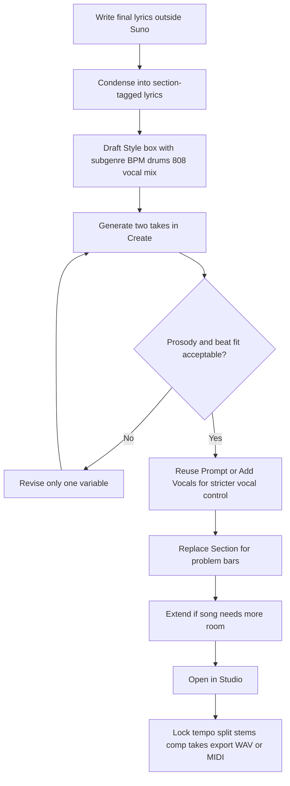

# Suno v5.5 Style Boxes for Paid Rap Production

## Executive summary

For paid Suno users working in rap with **their own lyrics**, the most reliable v5.5 workflow is to treat Suno as a two-field system plus a few control dials: the **Style** field defines the sonic blueprint, the **Lyrics** field defines words and section cues, **Exclude** removes unwanted traits, **Weirdness** controls how far the model departs from a conventional result, **Style Influence** controls adherence to the stated style, and **Audio Influence** becomes the practical “likeness” control when you are using uploaded audio or your own Voice profile. Suno’s March 2026 v5.5 release did **not** change the core prompt format from v5; it added **Voices**, **Custom Models**, and **My Taste** on top of the same basic prompting system. citeturn28view0turn28view1turn12view3turn27view4

For rap specifically, the strongest pattern across official material and credible user testing is that you get better control when you front-load the style box with **subgenre + BPM + drum identity + 808 behavior + vocal delivery + mix/aesthetic language**, then move **arrangement and timing cues** into the lyrics box with tags like `[Intro]`, `[Verse]`, `[Chorus]`, and short parenthetical cues such as `(ad-libs behind main vocal)` or `(bass cuts for 2 bars)`. Official Suno docs explicitly support detailed style instructions, structure tags, BPM/key cues, and section-level editing; community guides reinforce that rap benefits most when you specify low-end behavior and hat/snare patterns rather than using vague adjectives like “hard” or “dark.” citeturn24view0turn12view6turn24view3turn30view0turn26view0turn26view1

The single biggest practical tuning rule for rap on v5.5 is this: **if you want clean, non-chaotic, lyric-first rap, keep Weirdness below the midpoint and bias Style Influence upward**. Officially, 50% Weirdness is the “normal” expected result; in community testing on v5.5, several advanced users report best control with **very low Weirdness and high Style Influence**. By contrast, experimental rap benefits from climbing Weirdness and relaxing Style Influence slightly so the model can take more risks. citeturn12view3turn24view6

Paid users have a genuine advantage beyond credits. Current paid plans unlock **v5.5**, **commercial rights for songs made while subscribed**, **priority queueing up to 10 concurrent generations**, **Voices**, **Custom Models**, **stem separation**, **longer uploads**, and, on Premier, **Suno Studio**. Those features matter directly to rap workflows because they let you (a) lock a consistent vocal identity, (b) maintain a recurring project sound, (c) split vocals/drums/bass for post work, and (d) edit bar-level phrasing via Replace Section, Extend, and Studio comping. citeturn20view0turn19view1turn19view4turn29view2turn29view3

## What Suno v5.5 officially supports

Suno’s current public documentation points to a stable v5.5 prompt architecture rather than a brand-new syntax. The March 26, 2026 v5.5 release notes describe the model as Suno’s “best and most personal” model with **richer arrangements, sharper vocals, and more dynamic sound**, while the customization stack is built around **Voices**, **Custom Models**, and **My Taste**. Separate v5.5 guidance from HookGenius, a specialized Suno-oriented guide, also reports that the prompt format, metatags, and current field limits are unchanged from v5; that aligns with Suno’s own public release framing. citeturn28view0turn28view1turn27view4

The operational inputs that matter most for rap production are summarized below.

| Control | What it does | Official syntax or behavior | Current practical limit |
|---|---|---|---|
| **Style field** | Sonic blueprint: genre, mood, instruments, vocals, production | Suno explicitly supports more detailed and even conversational style descriptions starting from v4.5+, and official examples include layered instrumentation and production language. citeturn24view0turn12view6 | Community guides tracking current v4.5/v5/v5.5 behavior report **about 1,000 characters**. citeturn27view3turn27view4 |
| **Lyrics field** | User-supplied lyrics plus structure/timing cues | Suno officially supports your own lyrics, structure tags like `[Verse]`, `[Chorus]`, `[Bridge]`, and added context in the Lyrics box. citeturn23search1turn12view6turn24view2 | Community guides tracking current models report **5,000 characters** on v4.5/v5/v5.5. citeturn27view3turn27view4 |
| **Exclude** | Removes unwanted instruments, voice styles, or traits | Officially, in Custom Mode → Advanced Options, enter any instruments or other details you do **not** want. citeturn12view4 | No official public char limit documented in the help pages I found. |
| **Weirdness** | Degree of creative deviation | Official doc: ranges from **Safe** to **Chaos**; **50%** is the normal expected result. citeturn12view3 | Slider-based |
| **Style Influence** | How tightly output follows your style input | Official doc: ranges from **Loose** to **Strong**. citeturn12view3 | Slider-based |
| **Audio Influence** | Adherence to uploaded audio / Voice profile | Official docs surface Audio Influence for audio-based workflows; Voice docs and FAQ recommend raising it when the voice does not sound enough like you. Add Vocals describes the same general idea as adherence to the original instrumental. citeturn12view2turn29view0 | Slider-based |
| **My Taste / Magic Wand** | Style augmentation / personalization | Officially, Magic Wand can generate a personalized style description, and with Style Augmentation enabled it reflects your listening and creation habits; My Taste is enabled by default but can be edited or disabled. citeturn12view0 | N/A |

One important terminology note: **Suno’s official docs currently document Weirdness, Style Influence, and Audio Influence**. I did **not** find an official Create-form control literally named **“Likeness”** in Suno’s public help or release-note pages during this research. In practice, rap producers should read “likeness” in two ways: **Style Influence** as *style-likeness*, and **Audio Influence** as *voice/reference-likeness* when Voices or uploaded audio are in play. That mapping is an inference from the documented controls, not an official Suno label. citeturn12view3turn12view2turn29view0

Official examples worth copying, even for rap, are less about genre than about **instruction shape**. Suno shows that the style field now tolerates sentences like “Create a melodic, emotional deep house song…” rather than only short comma tags, while the help center and marketing guide both emphasize that structure tags belong in the Lyrics box and BPM/key/instrument cues can be specified explicitly. citeturn24view0turn12view6turn15search3

The main community split is between **long, full-box prompts** and **short, tactical prompts**. One Reddit workflow claims best results by filling **950–990 characters** with specific descriptors, while another current v5.5 thread argues that the cleanest, most controllable outputs come from **short, comma-separated, tactical keywords**. For rap, the evidence favors a phased method: start short and tactical to lock the beat and vocal behavior; only expand toward long-form style prose when you must solve texture, sample color, or analog-vs-digital mix issues. citeturn31view0turn26view3turn24view5

## Rap style-box architecture and naming system

The most robust way to build rap style boxes is to separate them into **load-bearing layers**. HookGenius describes a six-layer prompt formula—genre, era, instrumentation, vocal direction, structure, production—while Reddit prompt guides and official Suno material converge on a similar division between **style/sound design** and **lyrics/arrangement**. In practice, rap works best when the Style box carries: **subgenre, BPM, low-end behavior, drum pattern vocabulary, vocal delivery, sample color, mix aesthetic, and overall mood**. The Lyrics box should carry: **your actual bars, section tags, and short performance/arrangement cues**. citeturn27view0turn24view5turn24view4turn12view6

A reliable rap style-box order is:

`[subgenre], [BPM], [808/bass behavior], [kick/snare/hat identity], [main melodic source], [vocal delivery], [mix/aesthetic], [mood/energy]`

That order follows two recurring community findings: first, **genre is load-bearing**; second, for drill and trap especially, **front-loading low-end behavior and rhythm cues** changes outcomes more than generic emotional adjectives do. citeturn27view0turn26view0turn26view1

The element-to-field mapping below is the most practical way to decide **where each rap production element belongs**.

| Rap element | Put it in the **Style** field when you want Suno to generate it | Put it in the **Lyrics** field when timing/placement matters | Put it in **Exclude** when unwanted | Better handled in **Studio / Sounds / Uploads** |
|---|---|---|---|---|
| **Lead vocal** | Yes: `dry close-mic rap vocal`, `deadpan delivery`, `aggressive triplet flow` | Yes: section cues, ad-lib placement, doubles, pauses | Yes: `sung hook`, `autotune`, `female backing vocal`, etc. | If consistency is critical, use **Voices** or **Add Vocals** over your beat. |
| **Ad-libs** | Yes: `layered ad-libs`, `call-and-response ad-libs` | Yes: `(Ad-libs: yeah, what, bow)` | Yes, if you want a clean mono lead only | Can also be added as separate vocal ideas in Studio. |
| **Drums** | Yes: `boom bap drums`, `trap drums`, `syncopated hi-hats`, `punchy snare` | Only for arrangement events: `(drums drop out for 2 bars)` | Yes | Separate stems later in Studio if you need to rebalance. |
| **808s / bass** | Yes, very explicitly: `sliding 808s`, `distorted 808`, `sustained sub bass` | Yes for entry/cut moments | Yes, if you want live bass instead of 808 | Use Studio / MIDI export if you need note-level control. |
| **Hi-hats / snares / percussion** | Yes, because they define subgenre | Yes for rolls, drops, stop-time hits | Yes | Use Sounds for custom one-shots/loops if Suno’s beat character is close but not exact. |
| **Synths / pads / keys** | Yes: `ominous bell`, `spacey pads`, `dark piano loop` | Usually no | Yes | Studio stems are better once you need arrangement surgery. |
| **Samples / sample feel** | Yes as a *texture*: `chopped soul samples`, `jazz piano loops`, `dusty vinyl crackle` | Only if cueing drops or stops | Yes | If you need literal custom sample content, use your own uploads or create compatible assets in Studio/Sounds. |
| **Ambient noises** | Sometimes: `rain ambience`, `city-night backdrop` | Yes when entering/exiting sections | Yes | **Suno Sounds** is officially designed for ambient noises, loops, and one-shots. |
| **FX / risers / glitches / whooshes** | Yes, but sparingly | Yes when tied to transitions | Yes | **Suno Sounds** is the cleanest official way to generate specific FX. |

This mapping is consistent with Suno’s own role split: the Style field carries genre/instrument/production information; the Lyrics field can carry section tags and extra contextual cues; Exclude removes things you do not want; Studio can layer stems and create additional parts; Sounds can generate specific FX, ambience, and drum one-shots or loops. citeturn24view0turn24view2turn12view4turn19view1turn32view0

For **naming conventions**, Suno itself encourages organization through **Workspaces**, and Studio auto-saves time-stamped project versions. The best paid-user convention is to make the naming scheme carry both the **creative hypothesis** and the **control settings** so you can audit what actually worked. A practical convention is:

`PROJECT__SUBGENRE__BPM__VOICE__Wxx-SIxx-AIxx__EXCL-vN__LYR-vN__TAKE-A/B`

Examples:

- `ALBUM1__UKDRILL__142__VOICE-RAW01__W12-SI88-AI76__EXCL-v3__LYR-v5__TAKE-A`
- `MIXTAPE2__BOOMBAP__92__DEFAULTVOX__W18-SI84__EXCL-v1__LYR-v2__TAKE-B`
- `EP3__EXPERIMENTALRAP__138__VOICE-HOOK02__W58-SI62-AI70__EXCL-v4__LYR-v8__TAKE-A`

That convention is not official, but it fits Suno’s official Workspace model, multi-version output behavior, and Studio version history. It also makes batch download and later DAW transfer much easier. citeturn19view0turn19view1turn19view5

For **exclusion lists**, Suno officially provides a dedicated Exclude field, and community guides find that inline negative syntax works best in the simple form **`no [element]`** when you need it inside a style prompt. For rap, the strongest exclusion lists are not broad and angry; they are **short, surgical, and subgenre-specific**. Over-excluding can produce brittle prompts. The most effective pattern is: **state the beat you do want very clearly, then exclude only the top 3–7 failure modes**. citeturn12view4turn27view2turn26view3

Paste-ready examples:

```text
Boom-bap raw-rap exclusion list
sung hook, autotune, trap hi-hat rolls, glossy synths, EDM risers, pop chorus, arena reverb
```

```text
Atlanta trap exclusion list
rock guitars, boom bap swing, jazz horns, acoustic drums, soul sample crackle, spoken-word hook
```

```text
UK drill exclusion list
major-key chords, lush pop pads, melodic singing, house piano, funk bass, boom bap drums
```

```text
Lo-fi conscious exclusion list
distorted 808, drill hats, aggressive ad-libs, trap sirens, EDM drops, shouted hook
```

```text
Experimental rap exclusion list
radio-pop chorus, polished corporate mix, generic trap loop, happy piano, clean EDM build
```

Community threads also imply a second rule that matters in rap: if Suno keeps forcing the song toward melodic hooks, do not rely on negatives alone. Strengthen the positive side with tags like `rap-only delivery`, `spoken hook`, `deadpan vocal`, `close-mic dry rap`, `raw underground hip hop`, or build the beat first and then **Cover**, **Add Vocals**, or **Reuse Prompt** from that base. citeturn26view2turn24view7turn29view0turn29view1

## Ready-to-use rap templates

The templates below are designed for **user-supplied lyrics** and current v5.5 behavior. They assume the **Style** field takes a concise but specific prompt, while the **Lyrics** field contains your own words plus structure/performance cues. Settings are recommended starting points, not hard rules. They are derived from Suno’s official style/lyrics split, Weirdness and Style Influence documentation, drill/trap community testing, and current rap-prompt guides. citeturn12view3turn24view0turn24view2turn26view0turn26view1

| Template | Intended use | Style box template | Suggested Exclude list | Weirdness | Style Influence | Audio Influence if using Voices/Add Vocals |
|---|---|---|---|---:|---:|---:|
| **East Coast boom-bap raw** | Dense bars, dry lead, minimal melody | `east coast boom bap, 92 BPM, dusty chopped soul samples, punchy kick and snare, dry close-mic rap vocal, spoken hook, head-nodding swing, vinyl crackle, raw basement mix` | `autotune, sung hook, trap hi-hat rolls, EDM risers, glossy pads, pop chorus` | 12–22 | 80–90 | 68–78 |
| **Soulful conscious boom-bap** | Storytelling, reflective delivery, warmer hook bed | `conscious hip hop, 88 BPM, soulful samples, warm Rhodes chords, tight boom bap drums, lyrical rap delivery, reflective mood, organic low end, intimate stereo image` | `drill hats, distorted 808, shouted ad-libs, EDM drops, arena reverb` | 14–24 | 78–88 | 65–75 |
| **Atlanta trap hard** | Punchy mainstream trap, aggressive verses | `atlanta trap, 140 BPM, heavy 808 bass, fast hi-hat rolls, sharp snare, dark synth melody, aggressive rap vocal, minimal arrangement, hard-hitting modern mix` | `rock guitar, boom bap drums, jazz loops, sung pop chorus, orchestral strings` | 16–28 | 82–92 | 72–82 |
| **Psychedelic trap melodic-rap** | Atmospheric modern trap with controlled melody | `psychedelic trap, 138 BPM, booming 808s, rolling hats, ambient synth pads, ad-libs behind lead, half-sung half-rapped vocal, wide cinematic mix, nocturnal mood` | `boom bap swing, acoustic guitar, brass section, cheerful major-key hook` | 24–38 | 74–86 | 75–88 |
| **UK drill cold** | Strict drill pocket, triplet flow, dark piano | `UK drill, 142 BPM, sliding 808s, syncopated hi-hats, dark piano loop, aggressive triplet flow, deadpan rap vocal, menacing atmosphere, grime influence` | `melodic singing, warm soul samples, house piano, glossy EDM synths, funk bass` | 10–18 | 86–94 | 72–82 |
| **Brooklyn drill cinematic** | Bigger hooks, more space, New York feel | `brooklyn drill, 142 BPM, progressive sliding 808s, ticking hi-hats, icy synth pads, heavy new york vocal presence, layered ad-libs, dramatic sweeps, cold urban mix` | `boom bap swing, jazzy piano, soft sung chorus, organic guitar, bright pop lead` | 14–24 | 82–90 | 74–84 |
| **Lo-fi introspective rap** | Low-intensity bars, diary-like pacing, softer beat bed | `lo-fi hip hop rap, 78 BPM, soft piano chords, warm bass, brushed drums, low-key rap vocal, tape hiss, rain ambience, intimate bedroom mix, reflective mood` | `aggressive ad-libs, distorted 808, drill hats, pop chorus, EDM builds` | 18–32 | 72–84 | 62–74 |
| **Experimental industrial rap** | Abstract textures, asymmetry, art-rap | `experimental rap, 136 BPM, distorted sub bass, broken percussion, metallic textures, glitch fx, spoken-rap delivery, abrupt drops, industrial ambience, confrontational mix` | `radio-pop hook, glossy synth-pop, acoustic strumming, boom bap nostalgia, happy piano` | 42–62 | 58–72 | 68–80 |

These settings reflect a general trade-off. **Lower Weirdness + higher Style Influence** tends to improve subgenre lock, lyric clarity, and reproducibility. **Higher Weirdness + lower-to-mid Style Influence** is better when you want more unusual texture, beat mutation, or genre collision, but it increases the risk of strange intros, tonal drift, or unintended melody. Officially, 50% Weirdness is the midpoint/expected result; current v5.5 user testing repeatedly reports that stable results often come from going **well below** that for controlled work. citeturn12view3turn24view6

For the subgenres the user asked about, these are the best starting presets:

| Subgenre | Best starting range | Why |
|---|---|---|
| **Boom-bap** | Weirdness **12–24**, Style Influence **80–90** | You usually want fixed drum identity, dry lead, and less melodic drift. |
| **Trap** | Weirdness **16–30**, Style Influence **80–92** | Trap tolerates texture, but the drum/808 language must stay locked. |
| **Drill** | Weirdness **10–20**, Style Influence **86–94** | Drill falls apart fast if the 808/hat grammar loosens too much. |
| **Lo-fi rap** | Weirdness **18–32**, Style Influence **72–84** | A little drift helps atmosphere without breaking phrasing. |
| **Conscious / jazz rap** | Weirdness **14–26**, Style Influence **76–88** | You want warmth and musicality, but still strong lyric intelligibility. |
| **Experimental rap** | Weirdness **40–65**, Style Influence **55–75** | This is where the model’s surprises actually become the point. |

If you are using **Voices** or **Add Vocals**, treat **Audio Influence** as your voice-likeness dial. Suno’s own docs advise turning it up when the result does not sound enough like you, and Add Vocals frames the same control as adherence to the underlying instrumental or reference. A good practical split is: **65–75** for natural freedom, **75–85** for strong identity match, and **85+** only when likeness matters more than novelty. citeturn12view2turn29view0

## Lyrics injection, timing, and iteration workflow

The cleanest way to inject custom rap lyrics is to avoid stuffing everything into the Style field. Suno’s official guidance is consistent on this point: the Style field is for sound/genre/instrumentation, while the Lyrics field can include your own words and structural help such as `[Verse]`, `[Chorus]`, and `[Bridge]`. Suno also explicitly says newer models do better when you add more context in the Lyrics box, not just the Style box. citeturn23search1turn12view6turn24view2

A rap-friendly lyrics formatting pattern is:

```text
[Intro]
(4 bars, producer tag)
(your intro words here)

[Verse 1]
(dry lead, no melody)
(your bars)

[Hook]
(short repeated phrase, ad-libs behind main vocal)
(your hook words)

[Verse 2]
(double-time on bars 5-8)
(your bars)

[Outro]
(bass cuts out, ad-lib tail)
(your outro words)
```

That general approach is supported by Suno’s official structure-tag guidance and reinforced by current drill workflows from the user community, where phrases such as `(Aggressive triplet flow)`, `(Beat drops with sliding 808s)`, or `(Bass cuts out for 2 bars)` are used to steer rap phrasing without replacing the actual lyrics. citeturn12view6turn24view3turn26view0

When timing and prosody are the priority, use a **three-pass workflow**.



This flow matches Suno’s documented Create → Edit → Replace/Extend → Studio pipeline. The reasons are practical. Suno’s editor allows you to **replace sections**, **edit lyrics**, **add sections**, and—critically for rap timing—**adjust the number of beats in a new section** before generating it. Studio can then lock a project to **Manual BPM**, fix tempo drift, layer stems, comp alternative takes, and export multitrack WAV or MIDI for finishing in a DAW. citeturn30view0turn30view1turn19view1turn19view2

A few tactics matter disproportionately for rap prosody:

First, **fit line density to BPM and flow target**. If your style box says `92 BPM, dry boom bap, spoken hook`, do not write 16-bar triplet-density verses unless you also cue the flow change in the Lyrics field. Community drill testing shows that cues like `(Aggressive triplet flow)` and `(Flow switches to double-time)` help significantly. citeturn26view0

Second, if Suno keeps turning your hook melodic, **stop chasing the same full-generation prompt**. Either (a) make the hook more clearly spoken in the Lyrics cues, (b) build or reuse a beat you already like and then apply **Add Vocals**, or (c) create the best near-miss and use **Replace Section** over the exact problem bars. Officially, Add Vocals is meant for layering a custom vocal over an instrumental, while Replace Section is made for middle-of-song lyric or section surgery. citeturn29view0turn29view2

Third, for long rap songs, prefer **Extend** over overfilling a single generation. Current community tracking of field limits suggests current models allow 5,000 lyric characters, but practical quality often drops before the hard ceiling. Officially, Extend is designed exactly for continuing a song with new lyrics and style details, then stitching the result back into a whole song. citeturn27view3turn29view3

For **testing and iteration**, the best protocol is a controlled A/B system. Suno and Studio naturally support this because Create returns multiple versions, Studio uses take lanes, and many edit operations produce two alternatives. citeturn12view6turn19view1turn29view2

A practical scorecard for rap is:

| Metric | What to listen for | Suggested pass rule |
|---|---|---|
| **Lyric intelligibility** | Can you understand consonants and multisyllables? | >90% of bars understood on first focused listen |
| **Flow lock** | Does delivery fit beat subdivisions? | No obvious bar overruns or rushed cadences in final take |
| **Hook behavior** | Is it spoken/rapped vs sung as intended? | No unintended melodic hook if target is rap-only |
| **808 translation** | Does low end hold on headphones and speakers? | Clear sub movement without swallowing the vocal |
| **Snare/hat identity** | Does the groove read as boom-bap/trap/drill/etc.? | Immediate subgenre recognition within first 8 bars |
| **Artifact load** | Any title-singing, hiss, random voices, clipped wording? | Zero major artifacts, minimal minor artifacts |
| **Section compliance** | Do intros, drops, bass cuts, and outros happen when cued? | At least 80% of requested arrangement cues present |

For valid A/B tests, change **one variable at a time**: Style box wording, Exclude list, Weirdness, Style Influence, Audio Influence, or Lyrics structure cues. Also, if you want a genuinely controlled comparison, disable or freeze anything personalized. Suno’s own My Taste documentation says Magic Wand output reflects listening and creation habits when style augmentation is enabled, and My Taste is enabled by default. That means **My Taste is a confounder** if you are trying to measure whether a wording change actually improved your rap output. citeturn12view0

## Paid-user security, licensing, and operational considerations

For paid users, the operative production limits are not public API rate limits but **plan-based credits, queueing, and feature access**. As of the current pricing page, Pro includes **2,500 monthly credits**, Premier **10,000 monthly credits**, and both paid tiers support a **priority queue up to 10 songs at once**. The same page also says free users are in a shared queue with **4 concurrent generations**. For rap workflows that depend on heavy A/B testing, that concurrency difference is more important than almost any single prompt trick. citeturn20view0

Paid plans also materially change the editing stack. Pro and Premier both get **Voices**, **Custom Models**, **Add Vocals**, **stem separation**, longer uploads, and advanced editing, while **Suno Studio** is currently Premier-only according to the official Studio help article and pricing page. Advanced stem separation is also tiered: Pro gets **Auto Split** and **Split from Mix**, while Premier adds **Advanced Split**. citeturn20view0turn19view1turn19view4

On the **security/privacy** side, Suno’s policy says it collects **User Account Information**, **Content**, **Interactive Chat Information**, and usage data; it uses that information to provide the service, personalize features, secure the service, and improve its models. If you are producing commercially sensitive unreleased rap projects, you should assume your prompts, lyrics, and uploaded content are part of the service data footprint unless a separate enterprise arrangement says otherwise. citeturn22view1

For voice and model personalization, Suno’s official safeguards are stronger than many community tools. **Voices** require a verification phrase to confirm the singing/uploaded material belongs to the same person, and Suno states that your Voices are private and only you can use them. **Custom Models** require that you own the rights to the uploaded songs and are available only to Pro and Premier users; Suno says you can create up to **three** of them. citeturn28view1turn12view1turn12view5

On **licensing**, the key official rules are straightforward:

If you were subscribed when the song was created, Suno says you are considered the owner of the song and retain commercial-use rights even after cancellation. Paid-subscription help also says songs made while subscribed may be monetized, distributed to streaming services, and used commercially. By contrast, free-plan songs are non-commercial, and upgrading later does **not** grant retroactive commercial rights for songs created on the free plan. citeturn5search0turn5search1turn5search3turn23search6

For lyrics, Suno consistently states that **original lyrics you input are yours**, regardless of plan. If someone else wrote the lyrics, you must have permission, and the lyricist owns those lyrics. This matters directly for rap because many paid users treat Suno as a production engine for external toplines and bars; that is allowed only to the extent you control those rights. citeturn23search1turn23search0turn23search8

I did **not** find official public Suno developer/API documentation or official API-key issuance pages on Suno’s public help, pricing, release-note, or policy pages during this research. What Suno does document publicly is an **account-based** web/app workflow, official support channels, and plan-based concurrency. For operational safety, use the official Suno account system and official help channels; for support, the help center lists **support@suno.com** and **billing@suno.com** as the official channels. citeturn17search14turn22view0

A concise paid-user workflow checklist for rap production is:

- [ ] Put the project in a dedicated **Workspace** named for artist/project/subgenre/BPM. citeturn19view0  
- [ ] Draft the **Style** field in load-bearing order: subgenre → BPM → 808/bass → drums → melodic source → vocal delivery → mix. citeturn26view0turn26view1  
- [ ] Put all bars in the **Lyrics** field with `[Verse]`, `[Hook]`, `[Outro]`, and short parenthetical performance cues. citeturn12view6turn24view2  
- [ ] Add a short, surgical **Exclude** list for the top failure modes only. citeturn12view4turn27view2  
- [ ] Start with the template preset for the subgenre, and set **low-to-mid Weirdness** plus **high Style Influence** for control. citeturn12view3turn24view6  
- [ ] If using your own voice or a reference instrumental, set **Audio Influence** deliberately instead of maxing it automatically. citeturn12view2turn29view0  
- [ ] Run an A/B test with one changed variable only; if you use Magic Wand/My Taste, treat that as a separate test condition. citeturn12view0turn19view1  
- [ ] When the beat is right but the bars are wrong, use **Replace Section**; when the song is too short, use **Extend**; when the song is close but needs a new vocal pass, use **Add Vocals** or **Reuse Prompt**. citeturn29view0turn29view1turn29view2turn29view3  
- [ ] If the track is a keeper, split stems, lock BPM in Studio if needed, and export multitrack WAV/MIDI for finishing. citeturn19view2turn19view4turn30view1turn28view2  

The bottom line is that the best Suno v5.5 rap style boxes are **not** giant mood essays and they are **not** purely genre tags either. They are compact production briefs that tell Suno, in the first few tokens, **what kind of rap record it is, how the drums and 808 should behave, how the rapper should deliver, and what absolutely must stay out**. Then the Lyrics box does the rest. Official Suno tooling is now good enough that, for paid users, the real unlock is less “prompt magic” than **repeatable project hygiene**: stable naming, controlled A/B tests, section-level repair, and careful use of Voices, Custom Models, and stems. citeturn24view0turn12view6turn19view1turn28view0turn20view0